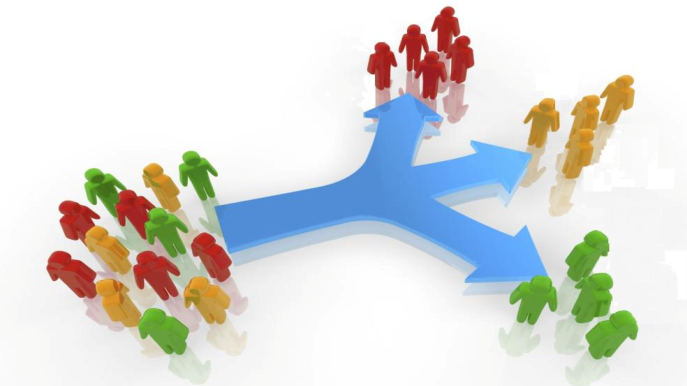
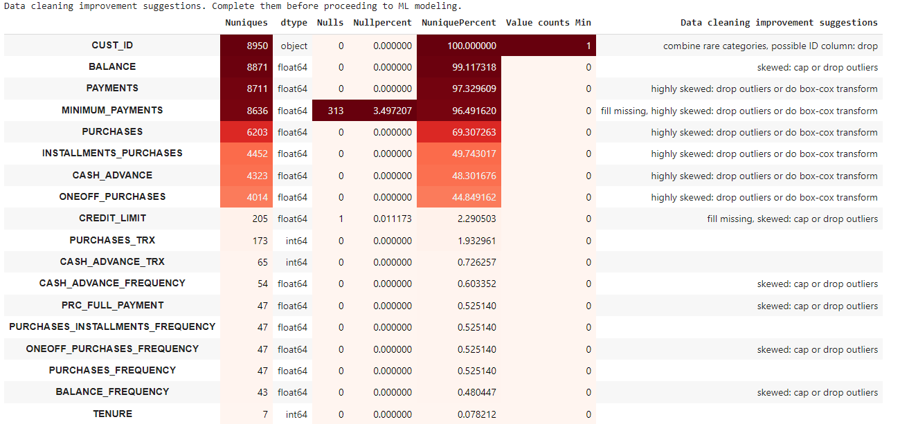
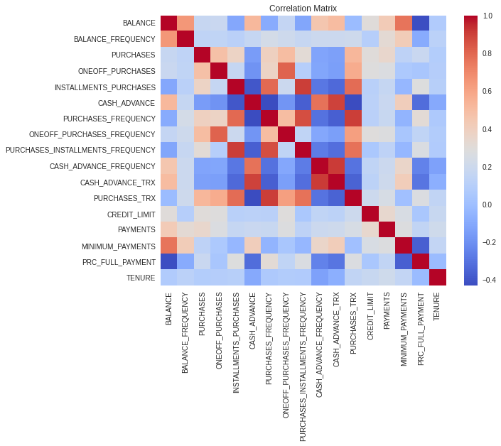
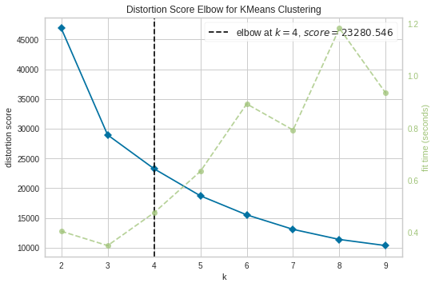

# Credit-Card-Clustering
Credit Card Clustering (PCA + Kmeans + Agglomerative Hierarchical + Gaussian Mixture + Clustering with PyCaret)

# Credit Card Clustering

The sample Dataset summarizes the usage behavior of about 9000 active credit card holders during the last 6 months. The file is at a customer level with 18 behavioral variables. You need to develop a customer segmentation to define marketing strategy from the dataset.

Full codes can be found [here] (https://github.com/wesam-alsohle/Credit-Card-Clustering-/blob/master)

# Objective

There are a lot of features in this dataset (18 behavioral features). We will now perform:

* Data preprocessing
* Feature extraction using PCA to reduce the dimensionality to improve clustering
* Experiment with various clustering models: KMeans, Agglomerative Hierarchical, Gaussian Mixture
* Clustering with PyCaret
* Choosing the number of clusters
* EDA to segment the customers

# Data Description
Link to the dataset: [Kaggle link](https://www.kaggle.com/arjunbhasin2013/ccdata)
Following is the Data Dictionary for Credit Card dataset:

* CUST_ID: Identification of Credit Card holder (Categorical)
* BALANCE: Balance amount left in their account to make purchases
* BALANCE_FREQUENCY: How frequently the Balance is updated, score between 0 and 1 (1 = frequently updated, 0 = not frequently updated)
* PURCHASES: Amount of purchases made from account
* ONEOFF_PURCHASES: Maximum purchase amount done in one-go
* INSTALLMENTS_PURCHASES: Amount of purchase done in installment
* CASH_ADVANCE: Cash in advance given by the user
* PURCHASES_FREQUENCY: How frequently the Purchases are being made, score between 0 and 1 (1 = frequently purchased, 0 = not frequently purchased)
* ONEOFFPURCHASESFREQUENCY: How frequently Purchases are happening in one-go (1 = frequently purchased, 0 = not frequently purchased)
* PURCHASESINSTALLMENTSFREQUENCY: How frequently purchases in installments are being done (1 = frequently done, 0 = not frequently done)
* CASHADVANCEFREQUENCY: How frequently the cash in advance being paid
* CASHADVANCETRX: Number of Transactions made with "Cash in Advanced"
* PURCHASES_TRX: Number of purchase transactions made
* CREDIT_LIMIT: Limit of Credit Card for user
* PAYMENTS: Amount of Payment done by user
* MINIMUM_PAYMENTS: Minimum amount of payments made by user
* PRCFULLPAYMENT: Percent of full payment paid by user
* TENURE: Tenure of credit card service for user

# Data Cleaning

One of the most important preprocessing steps in a Data Science project. In this project, I imputed missing values with the median value, dropped the CUST_ID column, then For our application I am looking for a good visualization so I would like to handle the skewness as much as possible as it will help the model to form better clusters.

## Correlation Check

##  Dimension Reduction using (PCA) 
Use PCA to reduce the dimensionality of our data. Select an appropriate number of components and analyze total variance explained. Interpret to make sense of the principal components.

## Clustering using K-Means

In this section we will perform K-Means clustering on the data and check the clustering metrics (inertia, silhouette scores).

### Inertia Plot

First, we make the inertia plot:

Using the elbow method, we pick a good number of clusters to be 4.

### Silhouette Scores

Silhouette analysis can be used to study the separation distance between the resulting clusters. The silhouette plot displays a measure of how close each point in one cluster is to points in the neighboring clusters and thus provides a way to assess parameters like number of clusters visually. This measure has a range of [-1, 1].

